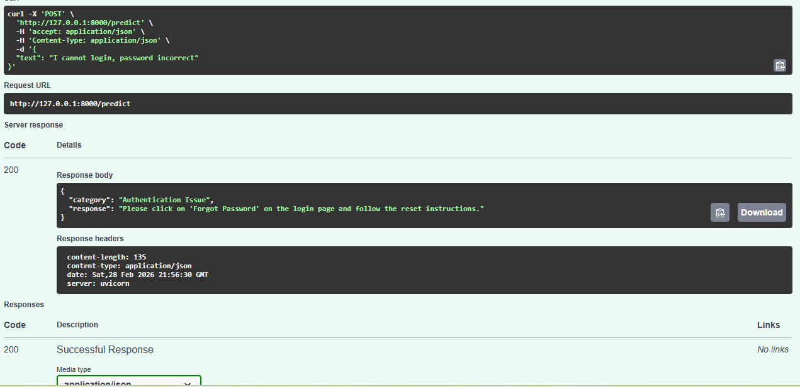

# AI Ticket Classification System

This project classifies support tickets into categories using NLP.

## Features
- Intent classification (Authentication / Leave Query)
- FastAPI REST API
- TF-IDF + Logistic Regression
- Auto-response generation

## How to Run

1. Install dependencies
pip install -r requirements.txt

2. Train model
python train_model.py

3. Run server
uvicorn main:app --reload

API Docs:
http://127.0.0.1:8000/docs

## API Demo (Swagger UI)

Below is the working FastAPI Swagger documentation showing ticket classification:

